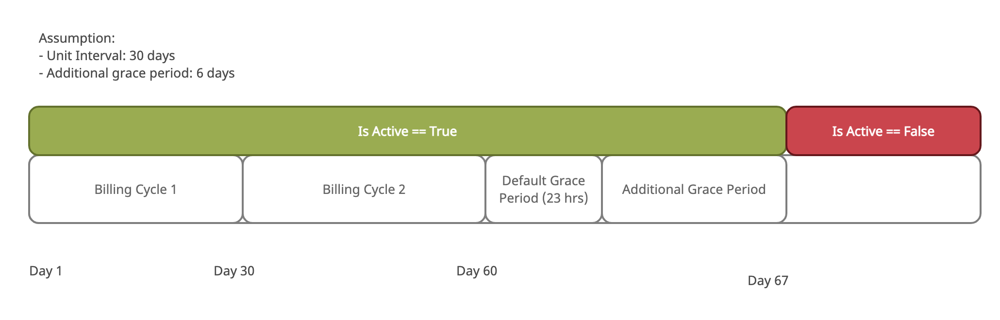

# Subscription

With subscriptions, customers can make recurring payments for access to a product.

Products describe the specific good or service that you offer to your customers. For example, you could offer a Standard or Pro version of your goods or services. Each version would be a separate product, and every product has a different contract address (as each product is instantiated as a separate smart contract on Terra blockchain)

## Subscription Lifecycle

### Creating a product

Creating a product requires a new contract to be instantiated. Products can be instantiated through the `product-factory` contract.

During the initialisation of the product, the contract owner can set the following configurations

- receiver_address: address that will receive the payments
- unit_amount: Amount to be charged in every billing cycle
- initial_amount: initial_amount that must be transferred to the receiver for the subscription to be created. Common in most services
- unit_interval_hour: Duration of the billing cycle in hours.
- past_due_tolerance_hour: Amount of time (in hours) that a subscription should still be active despite payment is due
- uri : Link to the JSON-formatted metadata of the subscription

The product factory will add the following fields to the product subscription contracts. These fields can be configured by an authorised user on the `product-factory` contract:

- job_registry_contact: Contract address of the job_registry. Required for automation
- factory_address: Address of the factory contract

The contracts do not validate the schema of the JSON in the URI. Suberra frontend supports the following format:

```json
{
  "chainId": "bombay-12",
  "contractAddress": "terra194t3lz704988568udhlw567rdwdzjwq3kgfecl",
  "title": "Delphi Insights",
  "description": "In depth market-wide reports.",
  "image": "https://uploads-ssl.webflow.com/60f1b19a593e774383e314f8/60f1b579fadff32863c4c47e_NavBar%20Logo.svg",
  "website": "https://delphidigital.io/pricing",
  "darkImage": null,
  "featured": true,
  "requiredFields": ["email"],
  "merchant": { "website": "https://delphidigital.io/" }
}
```

### Subscribing to product

1. User attempts to subscribe to product
2. If there an initial payment is required (`initial_amount >= 0` ), contract will attempt to deduct from the user's subwallet
3. Subscription activated

### Renewing the subscription

1. Charger attempts to charge by calling `ExecuteMsg::Charge{payer_address}`
2. Contract checks if the payer has a valid subscription that is still active (including grace period).
3. If there is a valid subscription that can be charged, the contract will transfer the corresponding aUST amount from the payer wallet to the merchant wallet
4. Along with the payload, there will be another payload which will instruct the fee_address to reward the worker who performed the task
5. Contract will also append messsage which instructs `WorkReceipt` to the job registry

If the subscription has expired, user will not get charged. To resume subscription, user will have to resubscribe again.

### Canceling an active subscription

1. User submits a cancelation request by sending `Cancel{}` msg to the subscription contract
2. Once canceled, the `is_cancelled` flag is set to `true`. Once canceled, subscription renewal charges will not be executed
3. User's subscription remains active until the end of the current billing period (Calculated as `last_charged` + `unit_interval`)

Users can resubscribe to a cancelled subscription by subscribing again. This will be considered as a new subscription creation request, and the `created_at` will be set to the new subscription creation timestamp.

### Checking Subscription status

Subscription contracts exposes an interface `QueryMsg::Subscription { "subscriber" : "terra1...123" }` that can get the user subscription status (active or inactive).



The subscription object:

```
{
  "subscriber": "terra1cs9udqtm2mg9hvqp0gzcyt5u9vkruygl78s57e",
  "created_at": 1637837874,
  "last_charged": 1638183474,
  "is_cancelled": false,
  "is_active": true,
  "discount: : None,
  "amount_chargeable": "0"
}
```

- `subscriber` : Subwallet address of the subscriber
- `created_at`: Timestamp when the subscription was first created
- `last_charged`: Timestamp in unix seconds when the subscription is last_charged
- `is_cancelled` : Boolean flag on whether the subscription has been cancelled
- `is_active`: Status on whether the subscription is active. Takes into account of the grace period (both default and additional grace period)
- `discount`: An optional Discount field
- `amount_chargeable`: Amount chargeable by the merchant or bots

Grace period can be set to give users access to the platform even if their subscription is overdue. By default, all subscriptions come with a 23 hour grace period. Merchants may add additional grace period to allow time to let customer retry their payments.

The following grid represents the different stages of the subscription and the expected value:

|                                                       | `is_active` | `amount_chargeable`           |
| ----------------------------------------------------- | ----------- | ----------------------------- |
| Within unit interval                                  | `true`      | 0                             |
| After unit interval and within grace period           | `true`      | Amt chargeable (e.g. 100 UST) |
| After unit interval (Within grace period) (Cancelled) | `false`     | 0                             |
| After grace period                                    | `false`     | 0                             |

`amount_chargeable` is set to 0 to prevent bots from executing charge function when the subscription has expired or is cancelled. To restart subscription, user can resubscribe again to resume, where a new subscription object will be created

### Discount

There are two ways that merchants can set discounts for the user.

#### Configure a lower `initial_amount` for the product

Merchants may want to offer users a cheaper price for the first sign-up. Suberra contracts allows merchants to input a different price for the `initial_amount` and `unit_amount` (subsequent charges).

### Set a `Discount` for a particular address

An authorised user (owner or admin) is able to set `Discount` for a particular address. Once set, the user's subsequent billing cycle will be discounted. Discount object does not apply for the first `initial_amount`.

A merchant or authorised user can also remove the Discount by setting the `Discount` for a particular address to be `None`.

This method is not a global change in pricing since only the targeted address has the discount. This feature may be linked to discount codes feature in the future.
